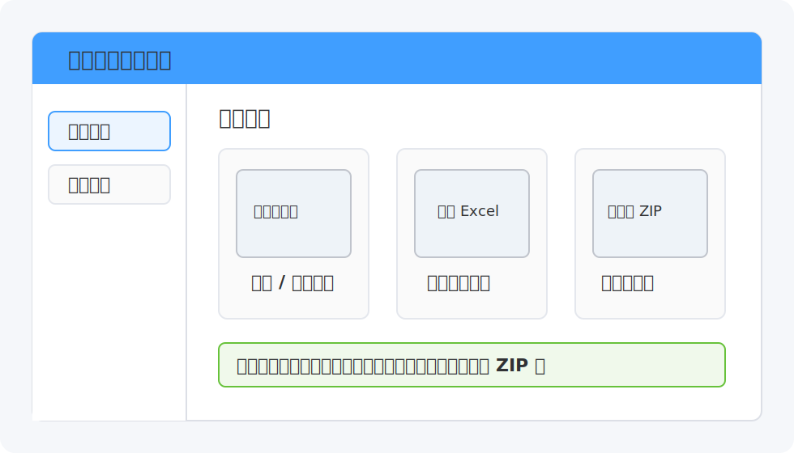
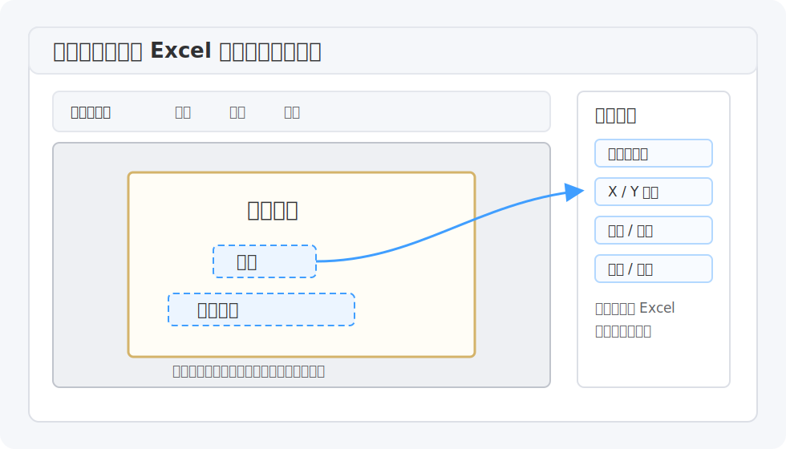
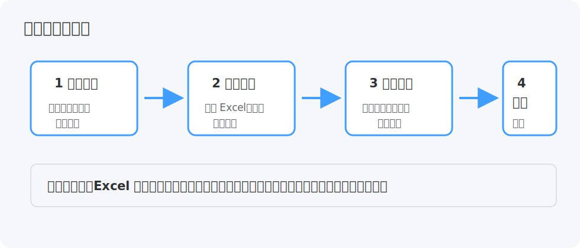
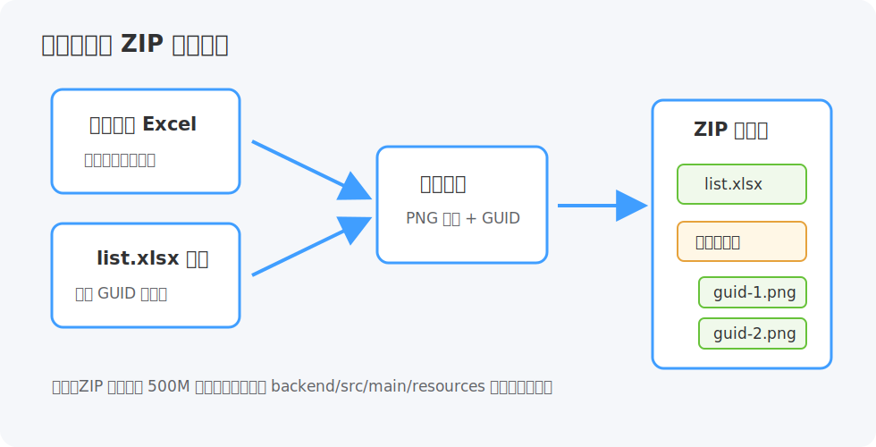

# 证书批量生成工具用户操作手册

适用对象：需要维护证书模板、批量生成证书图片/PDF、或生成小程序上传 ZIP 包的业务人员。

阅读建议：第一次使用请按“准备资料 -> 新建模板 -> 批量生成”的顺序操作。熟悉后可直接跳到对应章节。



## 1. 软件启动与激活

1. 双击打开“证书批量生成工具”。
2. 首次启动会显示“正在启动服务，请稍候...”，等待主界面出现即可。
3. 如果出现激活页面，在“授权码”输入框中填入授权码，点击“激活”。
4. 激活成功后进入主界面。以后本机可离线打开，系统会在后台做在线校验。

常见提示：

| 页面提示 | 处理方式 |
| --- | --- |
| 网络连接失败，激活需联网 | 检查网络后重新激活 |
| 无法获取机器标识 | 重启软件后再试 |
| 后端服务启动超时 | 稍等后重启软件；仍失败时点击右上角“日志目录”查看日志 |

## 2. 使用前准备

准备三类文件：

| 文件 | 必需场景 | 要求 |
| --- | --- | --- |
| 空白证书模板图片 | 新建模板 | PNG、JPG、JPEG 格式，建议使用清晰原图 |
| 学生数据 Excel | 普通生成、小程序 ZIP | 第一行为列名，每一行是一张证书的数据 |
| list.xlsx 模板 | 小程序 ZIP | 第一行为列名，必须包含一个用于写入 GUID 的列 |

Excel 表头示例：

| 姓名 | 课程名称 | 发证日期 | 证书编号 |
| --- | --- | --- | --- |
| 张三 | 人工智能实践 | 2026-06-23 | A2026001 |
| 李四 | 人工智能实践 | 2026-06-23 | A2026002 |

注意：Excel 列名要和模板中的“占位符名称”完全一致，例如模板里叫“姓名”，Excel 第一行也要叫“姓名”。

## 3. 主界面说明

主界面左侧只有两个核心菜单：

| 菜单 | 用途 |
| --- | --- |
| 模板管理 | 新建、编辑、重命名、删除证书模板 |
| 批量生成 | 选择模板和 Excel，批量导出证书或小程序 ZIP |

右上角“日志目录”用于排查异常。普通用户通常不需要打开，遇到生成失败或服务启动失败时再查看。

## 4. 新建证书模板

进入“模板管理”，点击右上角“新建模板”。

1. 在“模板名称”中输入容易识别的名称，例如“社会实践证书”。
2. 点击“选择图片”，上传空白证书底图。
3. 点击“确定”。
4. 创建成功后，系统会自动进入模板编辑器。

模板列表中的操作：

| 按钮 | 作用 |
| --- | --- |
| 编辑 | 进入模板编辑器，维护文字位置和样式 |
| 重命名 | 修改模板名称，不影响已配置的占位符 |
| 删除 | 删除模板和相关配置，删除后不可恢复 |

## 5. 编辑模板占位符

模板编辑器用于告诉系统：Excel 里的每个字段应该写在证书图片的哪个位置。



操作步骤：

1. 点击“添加占位符”。
2. 在证书图片上拖动新增的占位符，放到要打印文字的位置。
3. 在右侧“属性配置”中设置：

| 配置项 | 说明 |
| --- | --- |
| 名称 | 必须与 Excel 表头一致，例如“姓名”“课程名称” |
| X 坐标 / Y 坐标 | 精确调整文字位置，也可以直接拖动占位符 |
| 字体 | 选择宋体、黑体、楷体、微软雅黑、仿宋等 |
| 字号 | 设置文字大小 |
| 颜色 | 设置文字颜色 |
| 对齐 | 左、中、右；居中和右对齐适合姓名、编号等固定锚点 |

4. 重复添加所有需要写入证书的字段。
5. 点击右上角“保存”。

位置微调技巧：

| 操作 | 效果 |
| --- | --- |
| 拖动占位符 | 快速调整位置 |
| 方向键 | 每次移动 1 像素 |
| Shift + 方向键 | 每次移动 10 像素 |
| Delete | 删除当前选中的占位符 |
| 放大 / 缩小 / 适应 | 调整编辑视图，不影响最终生成尺寸 |

## 6. 普通批量生成证书

进入“批量生成”，系统会按四步引导完成生成。



### 第一步：选择模板

在模板卡片列表中点击要使用的证书模板，选中后点击“下一步”。

如果没有模板，请先回到“模板管理”新建模板。

### 第二步：上传数据

1. 上传学生数据 Excel 文件。
2. 系统解析后会显示“数据预览”，最多预览前 10 条。
3. 查看“占位符映射检查”：

| 状态 | 含义 | 处理 |
| --- | --- | --- |
| 已匹配 | 模板占位符在 Excel 中找到了同名列 | 可以继续 |
| 未匹配 | Excel 中没有对应列 | 修改 Excel 表头或回模板编辑器修改占位符名称 |

确认无误后点击“下一步”。

### 第三步：确认生成

选择生成模式为“普通生成”。

可配置项：

| 配置项 | 说明 |
| --- | --- |
| 输出格式 | PNG 图片、PDF 文件、PNG + PDF |
| 文件命名字段 | 可选择“姓名”“证书编号”等列作为文件名；留空则使用序号 |
| 输出目录 | 生成文件保存位置；Electron 桌面环境可点击“浏览”选择目录 |

确认后点击“开始生成”。

### 第四步：查看结果

生成完成后页面会显示总数、成功数、失败数。

| 操作 | 说明 |
| --- | --- |
| 打开输出目录 | 打开本次选择的输出文件夹 |
| 继续生成 | 清空当前步骤，重新选择模板和数据 |

如果有失败记录，页面会列出失败原因。常见原因包括：输出目录不存在、文件被占用、Excel 数据异常。

## 7. 生成小程序上传 ZIP 包

当需要交付给小程序后台时，在“确认生成信息”中选择“生成上传小程序模板”。



需要额外填写三项：

| 配置项 | 说明 |
| --- | --- |
| 上传 list.xlsx 模板 | 小程序要求的清单模板 |
| 选择 GUID 写入列 | 系统会为每张证书生成唯一 GUID，并写入该列 |
| 证书图片文件夹名称 | ZIP 内存放证书 PNG 的文件夹名称 |

生成结果：

```text
小程序上传包_1.zip
├── list.xlsx
└── 证书图片文件夹/
    ├── guid-1.png
    ├── guid-2.png
    └── ...
```

说明：

- ZIP 包内的 `list.xlsx` 位于根目录。
- 证书图片文件夹也位于 ZIP 根目录。
- 系统会尽量压缩 PNG 图片体积，同时保持图片清晰。
- 单个 ZIP 接近 500M 时会自动分包，例如 `小程序上传包_1.zip`、`小程序上传包_2.zip`。

## 8. 输出文件命名建议

普通生成时建议选择一个稳定且不重复的字段作为“文件命名字段”。

| 场景 | 推荐命名字段 |
| --- | --- |
| 学生证书 | 姓名 + 数据中避免重名，或使用学号/证书编号 |
| 活动证书 | 证书编号 |
| 批量归档 | 证书编号或唯一 ID |

如果选择“姓名”但存在重名，系统会自动处理重名文件，避免覆盖已有结果。

## 9. 常见问题

### 9.1 生成后的证书没有显示某个字段

检查模板占位符名称和 Excel 表头是否完全一致。大小写、空格、错别字都会导致未匹配。

### 9.2 中文字体显示异常

确认当前电脑安装了模板中选择的字体。建议优先使用 Windows 常见字体：宋体、黑体、楷体、微软雅黑、仿宋。

### 9.3 输出目录无法选择

在桌面版中点击“浏览”选择目录。如果是在浏览器开发环境中使用，需要手动输入本机目录路径。

### 9.4 生成过程中提示连接断开

检查输出目录是否可写、磁盘空间是否充足，然后点击右上角“日志目录”查看详细日志。

### 9.5 小程序 ZIP 里没有看到源码目录

这是正常结果。ZIP 根目录应该直接包含 `list.xlsx` 和证书图片文件夹，不应包含 `backend/src/main/resources` 等开发目录。

## 10. 推荐操作流程

第一次建模：

```text
准备空白证书图片
  -> 模板管理
  -> 新建模板
  -> 添加占位符
  -> 保存模板
  -> 用少量 Excel 数据试生成
  -> 确认位置和字体
  -> 正式批量生成
```

日常生成：

```text
批量生成
  -> 选择模板
  -> 上传 Excel
  -> 检查字段映射
  -> 选择输出格式和目录
  -> 开始生成
  -> 打开输出目录核对文件
```

小程序上传：

```text
批量生成
  -> 选择模板
  -> 上传学生数据 Excel
  -> 选择“生成上传小程序模板”
  -> 上传 list.xlsx 模板
  -> 选择 GUID 写入列
  -> 填写证书图片文件夹名称
  -> 开始生成 ZIP
```

## 11. 给用户的检查清单

生成前请确认：

- 模板图片清晰，尺寸符合使用场景。
- 模板占位符已经保存。
- Excel 第一行是列名，不要合并单元格。
- Excel 列名与占位符名称一致。
- 输出目录存在并且有写入权限。
- 大批量生成前，先用 2 到 3 条数据试生成一次。

完成后请确认：

- 证书文字位置正确。
- 字体、字号、颜色符合要求。
- 普通生成文件数量与 Excel 数据条数一致。
- 小程序 ZIP 内部直接包含 `list.xlsx` 和证书图片文件夹。
